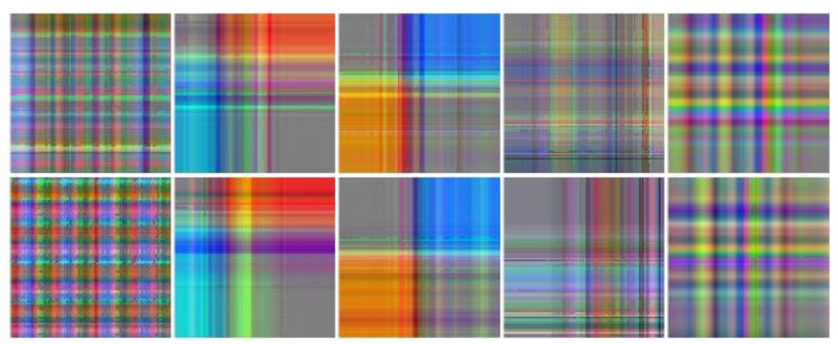

# Encoding Accelerometer Signals as Images for Activity Recognition Using Modified Recurrence Plot

Paper link: TBD
### Table of Contents
0. [Introduction](#Introduction)
0. [Datasets](#datasets)
0. [Modified RP](#ModifiedRP)
0. [Tiny ResNet](#TinyResNet)
0. [Results](#Results)

### Update (August 14)
We compared a new baseline LSTM-FCN, whose accuarcy is slightly lower than our method. We redesigned a tiny classification model and now it can predict very fast (100 5s-block samples for 6s+ on GPU). As always, we welcome any questions, suggestions, requests or bug-reports. 

### Introduction

The general overview of the proposed action recognition framework is shown as follows. It can be regarded as two stages. First, we project each channel signal as a square matrix using modified RP respectively and combine them into a color image. After normalization, we implement a tiny ResNet to do the classification task end to end. 

### Datasets

0. [ASTRI DATASET](https://github.com/lulujianjie/HAR_Using_ModifiedRP/tree/master/Datasets/MotionData)
Description is not available now for blind review

0. [ADL DATASET](https://archive.ics.uci.edu/ml/datasets/Dataset+for+ADL+Recognition+with+Wrist-worn+Accelerometer)
ADL is a public dataset
### ModifiedRP
The modified RP is first proposed in our paper to overcome its tendency confusion problem, which has improved our system performance significantly.

You can find more example of ASTRIA DATASET at [link1](https://github.com/lulujianjie/HAR_Using_ModifiedRP/tree/master/Datasets/Data%20Visualization/MotionData_modifiedRP) and ADL DATASET at [link2](https://github.com/lulujianjie/HAR_Using_ModifiedRP/tree/master/Datasets/Data%20Visualization/ADL_modifiedRP)

You can also encode your own accelerometer signals or time series data as images using [our code](https://github.com/lulujianjie/HAR_Using_ModifiedRP/blob/master/Model/encoding/RP-forADL.py)
	
### TinyResNet
You can train our model use [python](https://github.com/lulujianjie/HAR_Using_ModifiedRP/blob/master/Model/ResNet.py) or [jupyter notebook](https://github.com/lulujianjie/HAR_Using_ModifiedRP/blob/master/Model/ResNet.ipynb)

You can also use our pretrained model on ASTRI DATASET [link1]() and ADL DATASET [link2]() 

The structure is shown as follows

### Results

